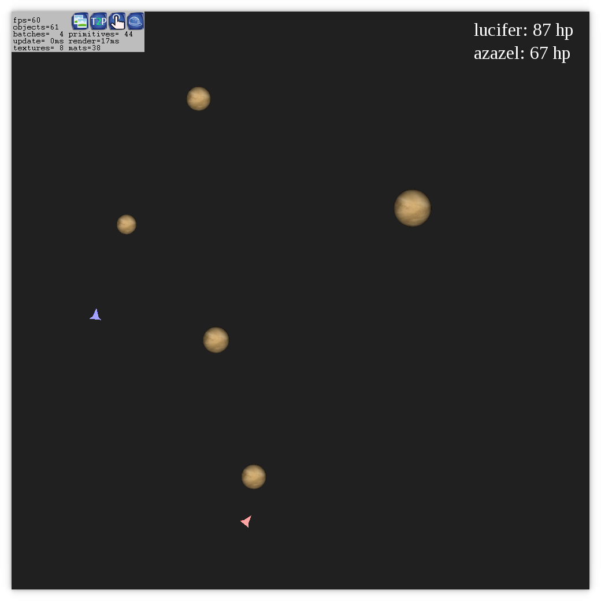

# Capstone [](https://github.com/anarchuser/Capstone/actions) [](https://github.com/anarchuser/Capstone/blob/master/LICENSE)

Control a spaceship through a field of planets. In space. On a Torus manifold.

----



----

### Setup

1. Clone this repository and change working directory:
```shell
git clone --recurse-submodules -j5 https://github.com/anarchuser/Capstone;
cd Capstone
```

2. Install dependencies:
```shell
./configure
```

3. Run the project:
```shell
make
```

### How to play

Currently, the following features are available:
1. Control the spaceship using `WASD` or `arrow keys`
2. Spawn immobile planets exerting gravity on the spaceship with `P`
3. Toggle debug view with `` ` ``

Copyright © 2022 Aaron Alef <aaron.alef@code.berlin> [@anarchuser](https://github.com/anarchuser)
