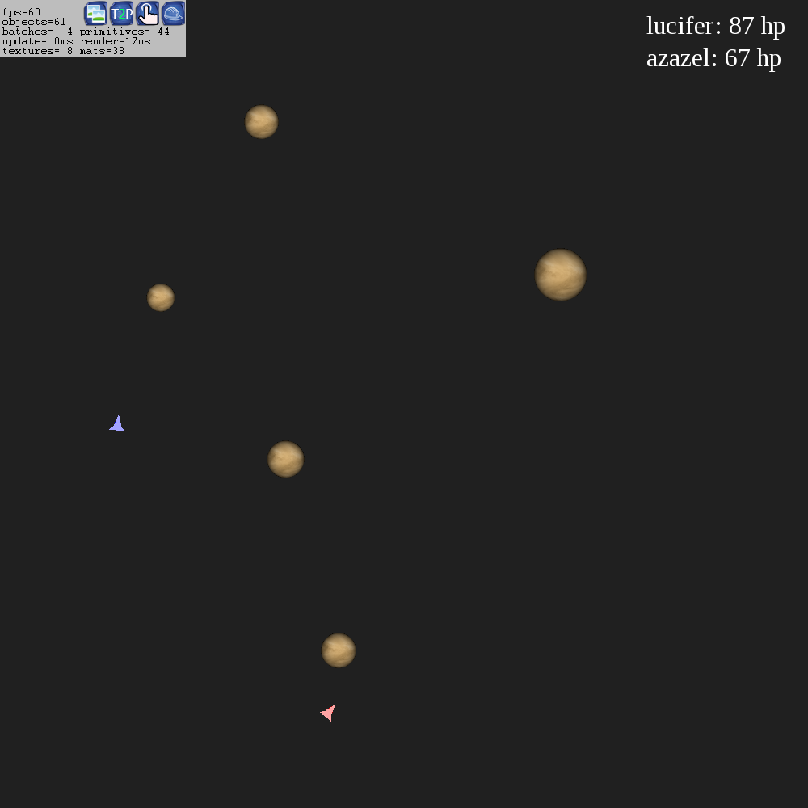

# Capstone [](https://github.com/anarchuser/Capstone/actions)  [](https://codedocs.xyz/anarchuser/Capstone/) [](https://github.com/anarchuser/Capstone/blob/master/LICENSE)

Control a spaceship through a field of planets. In space. On a Torus manifold.

----



----

### Setup

1. Clone this repository and change working directory:
```shell
git clone --recurse-submodules -j5 https://github.com/anarchuser/Capstone;
cd Capstone
```

2. Install dependencies:
```shell
./configure
```

3. Run the project:
```shell
make
```

### How to play

The game itself is simple - fly the spaceship using `WASD` or `arrow keys` without colliding with anything. Once your health points reach 0, you die.  

From the main menu you can also join another player on a remote machine in the same local network. To play together one player starts a game instance and all others connect to the IP address of the first machine.

Pressing `Escape` in-game opens a menu that allows you to restart, disconnect, and close the game.

### Features (planned _vs_ work-in-progress)

* [ ] Game play
  * [x] Control a spaceship using the keyboard
  * [x] Spawn planets exerting gravitational pull onto spaceships
  * [x] Damage spaceships on collision
  * [ ] Allow shooting of bullets
* [x] UI/UX
  * [x] Provide a main menu
  * [x] Provide an in-game menu
  * [x] Allow restarting and quitting the game
  * [x] Enter the ip to connect to
  * [x] Change the username in-game
  * [x] Read host- and username from env variables
* [ ] Network
  * [x] Connect to another player's game client
  * [x] Ensure clients use the same RNG seed
  * [x] Mirror local commands to remote spaceship too
  * [x] Join back to the other client
  * [x] Run game over player 1's local backend
  * [x] Run game over each player's local backend
  * [x] Share all existing connections back
  * [x] Handle disconnects smoothly
* [ ] Synchronisation
  * [x] Transmit initial spaceship data on join
  * [x] Continuously synchronise spaceships per server across clients *
  * [x] Synchronise spaceships across servers *
  * [ ] Reach consensus of current game state
  * [ ] Enforce consensus to every client
  * [ ] [maybe] Detect and kick cheaters
    * [ ] Enforce physics constraints (no teleportation)
    * [ ] Compare game state diffs across servers

| * Synchronise spaceship = Client force-updates 

----

Copyright © 2022 Aaron Alef <aaron.alef@code.berlin> [@anarchuser](https://github.com/anarchuser)
